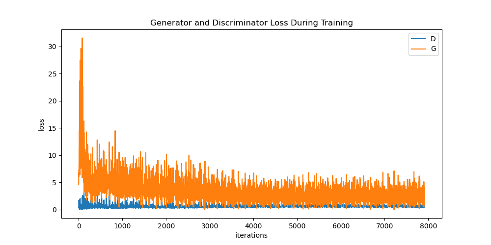
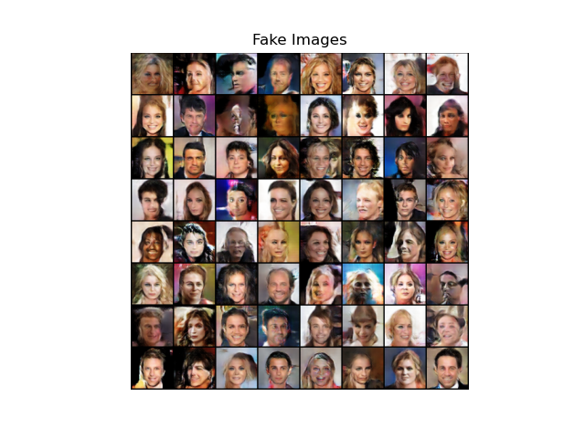

## DCGAN

This is an implementation of DCGAN using pytorch.

## Result

## Reference

[DCGAN tutorial](https://pytorch.org/tutorials/beginner/dcgan_faces_tutorial.html)

[original paper](https://arxiv.org/abs/1511.06434)
